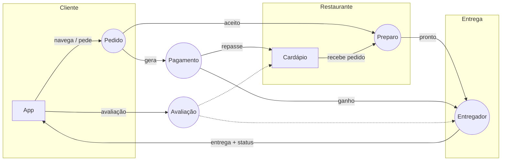

# Aula 1.1 — Introdução à Modelagem de Domínio
## Respostas às Atividades do Slide

**Disciplina:** Modelagem de Domínio (FACOM33505) — UFU, 2026/2
**Professor:** Victor Sobreira
**Fontes consultadas:** Wikipedia (Merge Sort, Quicksort, Mapa Conceitual, Modelo Mental, UML, BPMN), Engenharia de Software Moderna — Prof. Marco Tulio Valente (engsoftmoderna.info/artigos/ddd.html), material da própria aula.

---

## Atividade 1 — Conceito de Modelos (slide 9)

### 1. Modelos que você já viu, usou e/ou experimentou (ao menos três)

| Modelo | Tipo |
|---|---|
| Mapa do Google Maps | Físico/espacial (digital) |
| Globo terrestre | Físico |
| Lei de Ohm (V = R·I) | Matemático |
| Diagrama de classes UML | Conceitual/computacional |
| Protótipo de interface (Figma) | Conceitual/computacional |

### 2. Propósito e utilidade

- **Google Maps:** representar o espaço geográfico de forma navegável, permitindo planejar rotas sem conhecer o território. Útil porque abstrai detalhes irrelevantes (relevo, largura exata de ruas) e destaca o essencial (vias, distâncias, tempo).
- **Globo terrestre:** compreender geografia global, fusos, climas e a forma real do planeta. Útil por dar uma visão holística impossível de obter olhando mapas planos (que distorcem áreas).
- **Lei de Ohm:** prever o comportamento de circuitos elétricos com uma fórmula simples. Útil porque resume milhares de experimentos em uma relação entre três grandezas.
- **Diagrama de classes UML:** comunicar a estrutura de um sistema entre desenvolvedores. Útil porque formaliza entidades e relacionamentos em uma notação padrão.
- **Protótipo de interface:** validar layout e fluxo com usuários antes de implementar. Útil porque é barato de alterar.

### 3. Características específicas e comuns

**Comuns (as 4 da aula):**
- **Simplicidade** — todos ignoram detalhes irrelevantes para o objetivo (o mapa não mostra cada poste; a Lei de Ohm ignora temperatura do condutor).
- **Abstração** — focam nos aspectos mais importantes do alvo (rotas, fronteiras, tensão/corrente).
- **Analogia** — usam elementos conhecidos para representar desconhecidos (símbolos de mapa, setas em diagramas).
- **Formalidade** — empregam linguagem/estrutura específica (projeção cartográfica, notação matemática, sintaxe UML).

**Específicas:** o globo preserva proporções 3D; o mapa digital é dinâmico e atualizável; a fórmula permite cálculo exato; o diagrama UML serve de contrato entre equipe; o protótipo é descartável.

---

## Atividade 2 — Exemplos de Modelos Gerais (slide 16)

### 1. Outros três modelos marcantes

1. **Tabela periódica** (modelo químico)
2. **Relógio analógico** (modelo físico do tempo)
3. **Infográfico do sistema digestório** (modelo conceitual, típico de livro didático)

### 2. Propósito e utilidade

- **Tabela periódica:** organizar todos os elementos químicos por propriedades, prevendo comportamento de elementos ainda pouco estudados. Organiza o conhecimento e permite inferência.
- **Relógio:** representar a passagem do tempo de forma cíclica e legível, convertendo um conceito abstrato (tempo) em posições visuais.
- **Infográfico do sistema digestório:** explicar o caminho e a transformação dos alimentos por etapas, usando setas, cores e ícones.

### 3. Como ajudaram a compreender + vantagens e desvantagens

| Modelo | Como ajudou | Vantagens | Desvantagens |
|---|---|---|---|
| Tabela periódica | Visualizar famílias de elementos e tendências (eletronegatividade, raio atômico) | Densidade de informação altíssima; previsão de propriedades; padrão universal | Não explica o "porquê" (exige teoria atômica); assusta iniciantes |
| Relógio | Ler o tempo sem esforço cognitivo | Intuitivo; leitura angular rápida; não precisa de texto | Não mostra fusos, data ou durações longas |
| Infográfico | Entender um processo sequencial em segundos | Memória visual forte; simplifica anatomia complexa | Simplifica demais (perde exceções); pode criar conceitos errados se mal desenhado |

**Padrão comum:** todos trocam fidelidade por clareza — e isso é desejável, desde que as simplificações sejam conscientes.

---

## Atividade 3 — Entendendo o Merge Sort (slide 24)

### 1. Funcionamento geral do algoritmo (a partir do código)

O Merge Sort é um algoritmo de ordenação por comparação que usa a estratégia **dividir-para-conquistar** (Wikipedia, *Merge sort*):

1. **Dividir:** calcula o ponto médio do vetor (`meio ← (inicio + fim) / 2`) e o divide em duas metades, recursivamente, até que cada sub-vetor tenha 1 elemento (que já está ordenado por definição).
2. **Conquistar/Combinar:** a função `merge` recebe duas metades **já ordenadas**, copia cada uma para um vetor auxiliar (`Esq` e `Dir`), e percorre os dois simultaneamente, sempre copiando de volta para o vetor original o menor elemento entre os dois cursores (`idxEsq`, `idxDir`).

No código dos slides: `mergesort()` faz a recursão e a divisão (linhas 03–05) e delega a fusão para `merge()` (linha 06), que cria os sub-vetores (linhas 02–09), inicializa índices (10–11) e intercala comparando `Esq[idxEsq] < Dir[idxDir]` (linhas 12–15+).

**Complexidade:** Θ(n log n) no melhor, médio e pior caso — a divisão gera log n níveis e cada nível custa Θ(n) na fusão. Requer memória auxiliar Θ(n).

### 2. Reflexão

- **Foi fácil entender a partir do código?** Não totalmente. O código detalha *como* (índices, trocas), mas esconde *por que* funciona — a lógica recursiva e o invariante "funde duas listas ordenadas" ficam implícitos. A animação/diagrama do algoritmo torna a compreensão quase imediata.
- **Usou conhecimento anterior?** Sim: (a) já se conhecia o algoritmo e sua animação; (b) conhecimento de recursão e de divisão-e-conquista; (c) familiaridade com pseudo-código.
- **Há formas melhores de entender? Quais?**
  1. **Animação/visualização** (como a gif do Wikipedia) — mostra o fluxo de divisão e fusão passo a passo;
  2. **Executar com exemplo pequeno no papel** (vetor de 8 elementos) anotando as chamadas;
  3. **Diagrama de árvore de recursão** — explicita os níveis e o custo;
  4. **Diagrama de fluxo de dados (DFD)** — como o slide faz, separando "Dividir" e "Conquistar";
  5. **Explicar com palavras para outra pessoa** (técnica Feynman).

**Conclusão pedida pelo slide:** o código sozinho é um modelo ruim para *entender*; modelos de nível mais alto (diagramas, animações, linguagem natural) comunicam melhor — que é exatamente a tese da disciplina.

---

## Atividade 4 — Quick Sort em 4 representações (slide 39)

### 1. Explicando o Quick Sort em diferentes perspectivas

**a) Linguagem natural**
> Escolha um elemento da lista como **pivô**. Reorganize a lista de modo que tudo que é menor que o pivô fique à sua esquerda e tudo que é maior fique à direita (partição) — o pivô então já está em sua posição final. Repita o processo, recursivamente, na sub-lista da esquerda e na da direita, até que as partes tenham 0 ou 1 elemento (que já estão ordenadas). (Wikipedia, *Quicksort* — algoritmo de C.A.R. Hoare, 1960/1962.)

**b) Diagrama livre**

```
[8, 3, 5, 9, 1]   pivô = 5
        │ partição
        ▼
[3, 1] < 5 > [8, 9]        ← 5 fixado
   │                │
 recursão        recursão
[1, 3]            [8, 9]
   └──────┬────────┘
          ▼
    [1, 3, 5, 8, 9]
```

**c) Pseudo-código**

```
01. quicksort(A, esq, dir)
02.    se (esq < dir)
03.       p ← particiona(A, esq, dir)
04.       quicksort(A, esq, p - 1)
05.       quicksort(A, p + 1, dir)
06.
07. particiona(A, esq, dir)   // método de Lomuto
08.    pivo ← A[dir]
09.    i ← esq - 1
10.    para j ← esq até dir - 1
11.       se (A[j] <= pivo)
12.          i ← i + 1; troca A[i] ↔ A[j]
13.    troca A[i + 1] ↔ A[dir]
14.    devolve i + 1
```

**d) Diagrama formal (DFD)**

```
         ┌────────────┐  sub-lista esquerda ┌────────────┐
lista ──▶│  PARTIÇÃO  │────────────────────▶│ QUICKSORT  │
         │ (pivô p)   │                     │ (recursivo)│
         │            │  sub-lista direita  └────────────┘
         │            │──────────────────────────▲
         └─────┬──────┘                          │
               │ p fixo (posição final)          │
               ▼                                 │
        [ ...p... ] ─── concatena resultado ─────┘
```

### 2. Comparação entre as representações

| Critério | Linguagem natural | Diagrama livre | Pseudo-código | Diagrama formal (UML/DFD) |
|---|---|---|---|---|
| **Clareza/facilidade** | Alta para conceito; ambígua para detalhes | Alta para o fluxo; imprecisa | Precisa e completa; exige ler com cuidado | Alta precisão + visão estrutural; exige conhecer a notação |
| **Público-alvo** | Qualquer pessoa | Time multidisciplinar, clientes | Desenvolvedores | Arquitetos, engenheiros, documentação técnica |
| **Curva de aprendizado** | Nenhuma | Mínima | Média (lógica + sintaxe) | Alta (notação padrão a dominar) |
| **Recursos necessários** | Nenhum | Papel/lousa | Editor de texto | Ferramenta (draw.io, Lucidchart, PlantUML) |
| **Contexto de aplicação** | Aulas, discussões com especialistas do domínio | Brainstorms, quadros de discussão, EventStorming | Implementação, provas, algoritmos | Documentação de arquitetura, contratos entre equipes, manutenção |

**Moral da comparação:** cada representação troca precisão por acessibilidade (ou vice-versa). A habilidade de *transitar* entre elas — e escolher a certa para o público certo — é o coração da modelagem.

---

## Atividade 5 — Como os exemplos atendem aos propósitos da modelagem (slide 48)

### 1. Três modelos analisados

**Modelo A — Animação/diagrama do Merge Sort** (ex. da aula)
- **Entendimento:** ★★★★★ — mostra a recursão e a fusão de forma imediata.
- **Comunicação:** ótimo em sala e entre pares; independe de linguagem de programação.
- **Análise:** permite visualizar por que o custo é n·log n (árvore de níveis).
- **Projeto:** serve de especificação antes de codificar.
- **Documentação:** fraco — animação é efêmera; precisa ser congelada em figura nos slides.

**Modelo B — Diagrama UML de classes do comércio eletrônico** (ex. da aula)
- **Entendimento:** bom para estrutura, fraco para comportamento (não mostra fluxos).
- **Comunicação:** excelente entre desenvolvedores; notação padrão (UML tem 14 tipos de diagrama e é padrão OMG desde 1997, ISO desde 2005).
- **Análise:** revela entidades, atributos e relacionamentos (Produto, Cliente, Pedido).
- **Projeto:** é praticamente o blueprint da implementação OO e do esquema de BD.
- **Documentação:** ★★★★★ — artefato estável, versionável, histórico.

**Modelo C — Protótipos de papel de interface** (ex. da aula)
- **Entendimento:** alinha o modelo mental dos usuários com a solução proposta.
- **Comunicação:** ideal com clientes leigos — ninguém precisa saber notação.
- **Análise:** valida fluxos e identifica problemas **antes** do custo de implementação (identificação precoce de problemas, um dos benefícios citados na aula).
- **Projeto:** ponto de partida para o design de UI.
- **Documentação:** fraco — descartável por natureza; precisa ser registrado (foto, anotações).

### 2. Representações alternativas para falhas/fracassos

| Modelo | Falha identificada | Alternativa/complemento |
|---|---|---|
| Animação Merge Sort | Não documenta; não mostra o código real | Adicionar o **pseudo-código anotado** ao lado + **DFD** (como o slide fez) |
| UML de classes | Não mostra comportamento nem regras de negócio | Complementar com **diagrama de sequência** (fluxo "realizar pedido") e **diagrama de estados** (Pedido: aberto → pago → enviado) |
| Protótipo de papel | Não valida regras de negócio nem dados | Complementar com **BPMN** do processo de compra (linguagem específica para processos de negócio, padrão OMG) e um **modelo de dados (ER)** |

---

## Atividade 6 — Modelo Mental: aplicação de entrega de comidas (slide 79)

### 1. Cenário de uso (do pedido à entrega)

1. **Cliente** abre o app, navega por restaurantes (busca, filtros, avaliações) e adiciona pratos ao carrinho.
2. Revisa o carrinho, aplica cupom, escolhe forma de pagamento (cartão salvo, Pix, na entrega) e **confirma o pedido** → evento `PedidoCriado`.
3. O **restaurante** recebe a notificação, aceita (ou rejeita) e inicia o preparo → `PedidoAceito`, `PedidoEmPreparo`.
4. Simultaneamente, o sistema procura **entregadores** próximos; um aceita a corrida → `EntregadorDesignado`.
5. Restaurante finaliza e embala; entregador chega, retira → `PedidoPronto`, `PedidoColetado`.
6. Cliente acompanha o status e a localização em tempo real no mapa.
7. Entregador conclui a entrega → `PedidoEntregue`; pagamento é liberado (menos taxa da plataforma); cliente pode avaliar → `AvaliacaoRegistrada`.

### 2. Atores, artefatos, ações e relacionamentos

**Atores:**
- Cliente (comprador)
- Restaurante (parceiro/estabelecimento)
- Entregador (courier)
- Plataforma (sistema — media pagamentos, taxas, suporte)
- (Secundário: gateway de pagamento, suporte)

**Produtos e artefatos manipulados:**
- Prato/Produto, Cardápio, Categoria
- Carrinho, Pedido, ItemDePedido
- Pagamento, Cupom
- Endereços (cliente e restaurante), Rota/Localização
- Avaliação (nota + comentário)
- Notificações/Eventos (PedidoCriado, PedidoEntregue...)

**Ações e operações:**
| Ator | Operações |
|---|---|
| Cliente | buscar restaurantes, montar carrinho, pagar, acompanhar, avaliar, reclamar |
| Restaurante | gerenciar cardápio, aceitar/rejeitar pedido, marcar pronto |
| Entregador | aceitar corrida, confirmar coleta, confirmar entrega |
| Plataforma | casar oferta e demanda, roteirizar, processar pagamento, repassar valores, medir qualidade |

**Relacionamentos essenciais:**
- Cliente **faz** Pedido(s); Pedido **contém** Item(ns)DePedido que referenciam Produtos.
- Pedido **pertence a** um Restaurante; Restaurante **possui** Cardápio com Produtos.
- Pedido **é entregue por** um Entregador (1:1 por corrida).
- Pedido **gera** um Pagamento; Pagamento **tem** comprovante e status.
- Eventos ligam as etapas: cada mudança de estado dispara notificações para os atores.

### 3. Diagrama ilustrativo do modelo mental



> Os balões `( )` representam eventos/estados do pedido; as setas, o fluxo de responsabilidades. A estrutura reproduz os elementos de domínio vistos na aula: **entidades** (Cliente, Restaurante, Entregador, Pedido, Produto), **atributos** (status, valor, endereço), **relacionamentos** (faz, contém, entrega), **regras de negócio** (pedido só é finalizado com pagamento confirmado; repasse só após entrega) e **eventos** (PedidoCriado, PedidoPronto, PedidoEntregue).

### 4. Comparação entre modelos de estudantes diferentes

**Similaridades esperadas (núcleo compartilhado):**
- Triangulação Cliente–Restaurante–Entregador;
- Pedido como entidade central com ciclo de estados;
- Pagamento intermediado pela plataforma;
- Avaliação ao final.

**Diferenças típicas — e por que elas importam:**
- Um modelo pode colocar **pagamento na entrega** vs. **pré-pago** → muda regra de negócio e risco de inadimplência;
- Um pode modelar **entregadores como funcionários** vs. **autônomos por corrida** → muda o domínio financeiro;
- Granularidade: alguns modelam `Carrinho` separado do `Pedido`; outros fundem os dois;
- Alguns lembram de **suporte/reclamações** (ator esquecido com frequência).

**Lição (entendimento compartilhado):** modelos mentais de pessoas diferentes divergem em detalhes que parecem óbvios para cada uma. Externalizá-los em diagramas e compará-los é o que revela suposições ocultas — exatamente o contra-exemplo do "Balanço de Árvore" do slide 78: sem alinhamento, cada um implementa o que *achou* que foi pedido.

---

## Glossário rápido (conceitos da aula, com base nas fontes)

- **Modelo:** representação simplificada de algo mais complexo, capturando elementos e relações essenciais.
- **Modelo computacional:** modelo do mundo real expresso em linguagem formal, com entradas, processamento, saídas e parâmetros.
- **Abstração:** do latim *abstraho* ("arrancar/separar") — isolar e focar nos aspectos relevantes, ignorando os demais.
- **Domínio:** contexto específico de problema/negócio onde um sistema é aplicado; contém entidades, atributos, relacionamentos, regras de negócio e eventos.
- **Processo de negócio:** sequência de atividades-chave que uma organização executa para alcançar seus objetivos; modelável com BPMN.
- **Especialista do domínio:** pessoa com conhecimento profundo da área (médicos em saúde, contadores em finanças); principal fonte de conhecimento, mas com disponibilidade limitada — envolver com técnicas estabelecidas.
- **Modelo mental:** representação interna que as pessoas constroem de como o mundo funciona (origem: Kenneth Craik, 1943); pode ser externalizado com Mapas Cognitivos, Mapas Mentais ou Mapas Conceituais (estes últimos de Joseph Novak, com conceitos ligados por frases de ligação formando proposições).
- **Entendimento compartilhado:** estado em que os envolvidos "falam a mesma língua"; base da comunicação eficaz, colaboração e decisão. Antecipa a **Linguagem Ubíqua** do DDD (Evans, 2003): termos comuns a especialistas e desenvolvedores, usados tanto na conversa quanto no código.