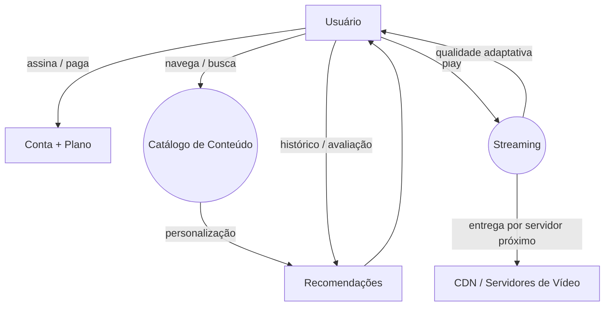
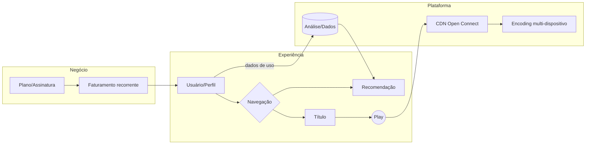
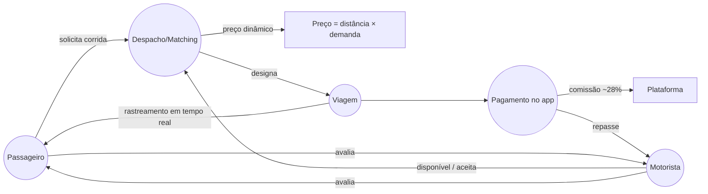
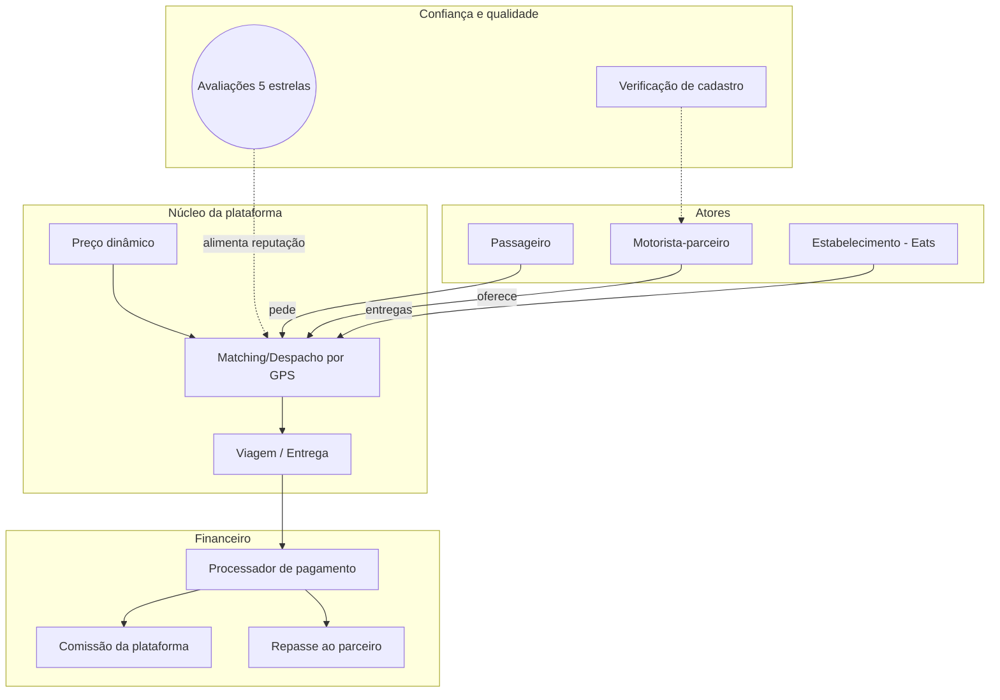
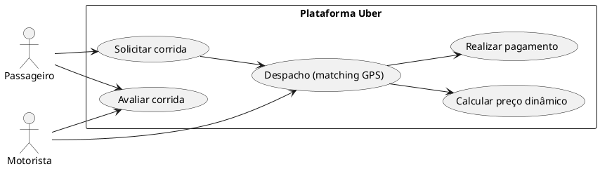
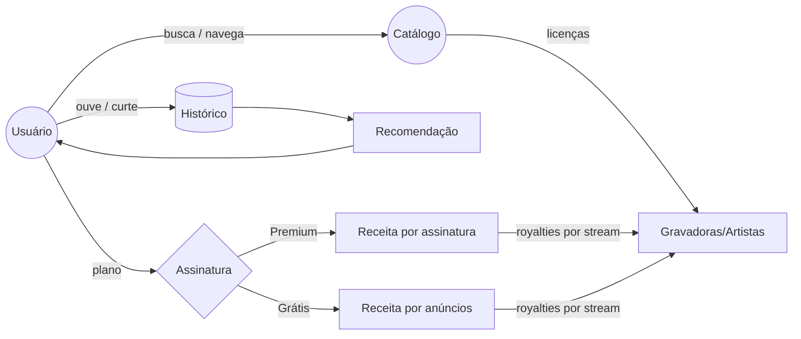

# Aula 1.2 — Modelos Mentais e Conhecimento Compartilhado
## Respostas às Atividades do Slide

**Disciplina:** Modelagem de Domínio (FACOM33505) — UFU, 2026/2
**Professor:** Victor Sobreira
**Fontes consultadas:** Wikipedia (Netflix, Uber, Tube Map, Harry Beck, Companhia do Metropolitano de São Paulo, Mind Map), GeeksforGeeks — *System Design Netflix* (arquitetura, componentes, stack), vdocipher.com — *Netflix Tech Stack Explained* (Open Connect CDN, microserviços), material da própria aula.

---

## Atividade 1 — Como funciona a Netflix? (slides 4–7)

### 1.1 Entendimento do funcionamento

A Netflix é um serviço de streaming por assinatura (fundado em 1997 como entrega de DVDs pelo correio; streaming desde 2007; mais de 232 milhões de assinantes em 190+ países). O funcionamento, do ponto de vista do usuário:

1. **Catálogo:** o usuário abre o app/site e navega por filmes, séries e documentários — organizados por gêneros, "top 10", "porque você assistiu X".
2. **Recomendação:** algoritmos analisam histórico de visualização, avaliações e preferências para personalizar a vitrine de cada perfil.
3. **Reprodução:** ao escolher um título, o app solicita o stream; o vídeo é entregue por uma rede de distribuição (CDN) que serve o conteúdo de servidores próximos ao usuário, com qualidade adaptada à conexão (bitrate dinâmico).
4. **Assinatura:** o acesso é controlado por conta e plano (com cobrança recorrente); múltiplos perfis e downloads offline em alguns planos.

### 1.2 Como explicaria para alguém

> "A Netflix é como uma locadora dentro da sua TV: você assina, recebe um catálogo gigante personalizado para você, e quando aperta play o filme é 'entregue' pela internet a partir do servidor mais próximo de você, ajustando a qualidade à sua conexão para não travar."

### 1.3 Modelo em papel (síntese)

**Elementos do modelo:** entidades (Usuário, Catálogo, Streaming, CDN, Recomendação), eventos (play, avaliação, assinatura), e o fluxo circular *assistir → histórico → recomendação → assistir*, que é a característica mais marcante do domínio Netflix.

---

## Atividade 2 — Comparando modelos da Netflix (slides 8–12)

### 2.1 Similaridades e diferenças típicas entre modelos de colegas

| Aspecto | Modelo do colega A (orientado a usuário) | Modelo do colega B (orientado a negócio) | Modelo do colega C (orientado a infraestrutura) |
|---|---|---|---|
| Foco | experiência: catálogo, perfil, play | assinatura, cobrança, retenção | servidores, CDN, codificação de vídeo |
| Entidades centrais | Usuário, Título, Fila | Plano, Assinatura, Receita | CDN, Encoder, Storage |
| O que esquece | infraestrutura | a experiência do usuário | tudo o que não é técnico |

**Similaridades:** quase todos incluem Usuário→Catálogo→Play (o fluxo essencial) e algum elemento de pagamento.
**Diferenças:** a granularidade e a perspectiva — o mesmo domínio admite modelos muito diferentes conforme o propósito (ver Atividade 3).

### 2.2 Modelo combinado e melhor

Um modelo melhor **separa as camadas do domínio** e liga as três perspectivas:

O insight do modelo combinado: a Netflix não é só "app de filmes" — é um **domínio de mídia** (conteúdo), um **domínio de assinatura** (receita) e um **domínio de infraestrutura de entrega** (CDN própria, a Open Connect, pela qual passam ~15 bilhões de horas de streaming por dia). Cada modelo dos colegas capturava um desses subdomínios.

---

## Atividade 3 — Os 5 modelos oficiais da Netflix (slide 18)

### 3.1 Comparativo e propósito de cada modelo

| Modelo (slide) | Propósito | Funcionalidade | Forte em | Fraco em |
|---|---|---|---|---|
| **Infográfico** (p.7) | Educar o público geral sobre o que é a Netflix | Explica história, números e funcionamento básico com ícones e figuras | Comunicação com leigos; memorização | Precisão técnica; não serve para engenharia |
| **Projeto arquitetural de alto nível** (p.8) | Comunicar a visão macro do sistema a engenheiros e gestores | Mostra blocos: clientes, API, microserviços, CDN, bancos | Entendimento compartilhado entre times | Detalhe de implementação |
| **Arquitetura do sistema** (p.9) | Documentação técnica de referência | Fluxo completo: ingestão de vídeo → codificação → armazenamento (S3) → distribuição (Open Connect) → player; microserviços independentes (autenticação, catálogo, recomendação, playback) | Manutenção, evolução, diagnóstico de falhas | Complexidade — exige conhecimento prévio |
| **Modelo de negócios** (p.10) | Explicar como a empresa ganha dinheiro | Assinatura mensal/anual → receita recorrente → investimento em conteúdo original → mais assinantes (ciclo virtuoso) | Alinhamento com executivos, sócios, investidores | Não descreve o sistema em si |
| **Ecosistema** (p.11) | Posicionar a Netflix no mercado | Atores externos: estúdios/produtores de conteúdo, provedores de internet (ISPs), dispositivos (TVs, celulares, consoles), concorrentes, reguladores | Estratégia e análise de parcerias/ameaças | Operação cotidiana |

### 3.2 Qual é o melhor? Para quem? Por quê?

**Não existe um "melhor" absoluto — cada modelo é o melhor para seu público e propósito:**

- Para **o assinante leigo**: o **infográfico** — ninguém assina um serviço lendo um diagrama de microserviços.
- Para **um novo engenheiro na Netflix**: a **arquitetura do sistema** — é o mapa que permite mexer no código sem quebrar tudo.
- Para **um investidor ou gestor**: o **modelo de negócios** — responde à única pergunta que interessa: "como isso vira lucro?".
- Para **um negociador de parcerias (ex.: com operadoras de internet)**: o **ecosistema** — mostra dependências e poder de barganha.
- Para **alinhamento rápido entre disciplinas**: o **alto nível** — o menor modelo que todos entendem.

**Moral (tese da aula):** um modelo é avaliado *em relação a um propósito e um público*. "Reflete fielmente a realidade?" não é a pergunta certa; "serve ao objetivo de quem vai usá-lo?" é.

---

## Atividade 4 — Como funciona o Uber? (slides 20–24)

### 4.1 Entendimento do funcionamento

O Uber é uma plataforma de **e-hailing** (mobilidade urbana por aplicativo), fundada em 2009, operando em ~70 países e 10.500+ cidades, com mais de 150 milhões de usuários ativos mensais e 6 milhões de motoristas, facilitando ~28 milhões de viagens por dia. Funcionamento essencial:

1. **Passageiro** solicita uma corrida informando origem e destino (GPS).
2. O sistema estima **preço** combinando distância, duração prevista e relação oferta/demanda de motoristas na região (*preço dinâmico* — "essa alocação inteligente é a base de lucros da empresa", Wikipedia).
3. O **algoritmo de despacho (matching)** localiza o motorista parceiro mais próximo disponível e oferece a corrida.
4. **Motorista** aceita → passageiro acompanha a chegada em tempo real no mapa.
5. Corrida realizada → **pagamento** é processado pelo app (cartão/Pix salvo), com comissão da plataforma (take rate ~28,7% em mobilidade) e repasse ao motorista.
6. Ambos se **avaliam** (nota 5 estrelas), o que alimenta a qualidade e a confiabilidade da rede.

### 4.2 Como explicaria para alguém

> "O Uber é um casador de caronas: quem precisa de uma viagem e quem tem um carro se encontram pelo GPS, o preço é calculado na hora pela lei de oferta e procura, o pagamento é automático, e as notas dos dois lados mantêm todo mundo bem-comportado."

### 4.3 Modelo em papel (síntese)

**Elementos:** entidades (Passageiro, Motorista, Viagem, Pagamento), evento central (**despacho** — o coração do domínio), regras de negócio (preço dinâmico, comissão, avaliação mútua obrigatória).

---

## Atividade 5 — Comparando modelos do Uber (slides 25–28)

### 5.1 Similaridades e diferenças entre colegas

**Similaridades:** todos capturam o triângulo Passageiro–Motorista–Corrida e o pagamento pelo app.
**Diferenças típicas:**

| Divergência | Impacto no modelo |
|---|---|
| Alguns modelam a **corrida**, outros a **viagem inteira** (solicitação→chegada) | Granularidade de estados do pedido |
| Alguns incluem **Uber Eats / frete** (a empresa é multi-serviço) | Escopo do domínio |
| Alguns detalham **preço dinâmico**; outros só "pagamento" | Profundidade das regras de negócio |
| Alguns incluem **segurança/regulação** (verificações de motorista) | Conformidade e confiança |

### 5.2 Modelo combinado e melhor

O modelo combinado deixa explícito que o **despacho** é o serviço central reusado por todos os produtos (corridas, comida, frete) — exatamente a estratégia da Uber de "plataforma de movimento".

---

## Atividade 6 — Sistema metroviário (slides 37–41)

### 6.1 A importância de um modelo claro, simples e conciso

Um sistema metroviário é usado **por milhões de pessoas sob pressão de tempo** (pegar o trem certo, fazer baldeação, chegar ao destino). O modelo público precisa:

- ser legível em **segundos** (leitura em movimento, às vezes no escuro);
- responder a **uma única pergunta**: "qual linha pego, onde troco, quantas estações até meu destino?";
- funcionar para **turistas que não falam a língua** e analfabetos funcionais;
- caber em uma folha, aplicativo e placas da estação.

Sem modelo claro, o sistema tecnicamente perfeito ainda **falha na experiência** — o usuário embarca na linha errada.

### 6.2 Que tipo de modelo proponho?

Um **mapa esquemático (diagramático)** — o modelo do **Tube Map de Londres, criado por Harry Beck em 1931**. Beck, um desenhista técnico do departamento de sinalização, percebeu que o passageiro não precisa de geografia: precisa da **topologia da rede**. Suas regras:

1. Linhas em cores distintas, com ângulos de 45°/90° apenas;
2. Estações como pontos, interligações destacadas;
3. Geografia real distorcida em favor da clareza.

O Metrô de SP usa este mesmo esquema hoje (mapa do sistema na cor, malha metroferroviária integrada, e mapas por linha como o da Linha 4-Amarela no slide).

### 6.3 O modelo deve refletir fielmente a realidade?

**Não — e essa é a lição central da atividade.** O Tube map de Beck é deliberadamente **infiel à realidade geográfica**: distâncias encurtadas/esticadas, rios ignorados, curvas reais viram ângulos retos. Mesmo assim (ou por isso) é um dos designs mais eficazes da história — porque a fidelidade que importa para o propósito não é geográfica, é **topológica e funcional**. Um mapa "fiel" (escala real) seria inútil dentro do trem.

**Mas atenção:** fidelidade parcial não significa arbitrária. O mapa esquema **preserva exatamente** o que o usuário precisa (sequência de estações, conexões, sentidos) e **abole** o que não precisa (distâncias, relevo, curvatura real). A escolha do que é essencial é a abstração certa.

### 6.4 O que deve ser abstraído?

| Abstraído (removido) | Mantido (essencial) |
|---|---|
| Distâncias reais entre estações | Ordem das estações |
| Geografia da cidade (ruas, bairros, rios) | Conexões entre linhas (baldeações) |
| Curvatura real dos trilhos | Nome/terminal de cada linha (cor + número) |
| Profundidade dos túneis, layout físico | Sentidos (terminais como referência) |
| Horários por estação (no mapa básico) | Estações terminais e marcos de integração |

**Síntese:** abstraímos tudo que não ajuda a responder "como vou de A para B?" — mantendo o mapa *verificável*: o que ele promete acontece na realidade.

---

## Atividade 7 — Ferramentas de modelagem (slides 45–47 + 48)

### 7.1 Reproduzindo diagramas com ferramentas

As ferramentas indicadas na aula, agrupadas:

| Categoria | Ferramentas | Melhor uso |
|---|---|---|
| **Mapas mentais** | XMind, GitMind, FreeMind | Modelos mentais, brainstorms, hierarquias radiais |
| **Diagramas gerais** | Draw.io (diagrams.net), Miro, Canva | Fluxos livres, DFDs, protótipos de arquitetura, colaboração em tempo real |
| **UML / texto-para-diagrama** | PlantUML | Diagramas versionáveis em texto (git), classes, sequência, casos de uso |

**Exemplo — recriando o modelo do Uber em PlantUML** (reproduzível e versionável):

**Comentário sobre limitações das ferramentas** (pedido no enunciado):

- **XMind/GitMind**: excelentes para mapas mentais rápidos, mas **não têm notação formal** (nada de UML/DFD); exportação livre limitada no plano gratuito; poluído para diagramas com fluxo direcional.
- **Draw.io**: o mais versátil (qualquer notação, incluindo UML e BPMN), gratuito, salva em arquivo local — mas o resultado é **estático** (imagem) e colaboração em tempo real exige conta/plano online.
- **Miro/Canva**: ótimos para colaboração visual em equipe (brainstorm, EventStorming), mas fracos para precisão notacional e para versionamento.
- **PlantUML**: único que gera diagrama **a partir de texto** — versionável no Git, revisável em PR, reproduzível; porém **curva de aprendizado da sintaxe** e layouts às vezes imprevisíveis (precisa ajuste manual).

**Recomendação prática da aula, na prática:** mapa mental para *extrair* o modelo da cabeça; Draw.io/Miro para *compartilhar e discutir*; PlantUML para *documentar de forma durável*.

### 7.2 Versão refinada dos esboços em ferramenta

A versão refinada do modelo da Netflix (Atividade 1.3) e do Uber (Atividade 4.3), agora com notação consistente, está nos diagramas Mermaid/PlantUML acima — todos em texto, portanto editáveis e versionáveis.

---

## Atividade 8 — Exercício com outra plataforma (slide 49)

Escolhido: **Spotify** (mesma lógica Netflix/Uber, domínio diferente).

### 8.1 Entendimento do funcionamento

1. Usuário ouve música via **streaming** (catálogo licenciado de gravadoras) ou **download offline**;
2. Algoritmos de recomendação (playlists personalizadas: *Discover Weekly*, *Radar*) analisam histórico, curtidas e comportamento;
3. **Freemium:** plano gratuito com anúncios ou Premium por assinatura (receita principal);
4. Pagamento repartido entre gravadoras/artistas por **streaming contabilizado**;
5. Camada social: playlists colaborativas, seguidores, integração com amigos.

### 8.2 Modelo mental do Spotify

### 8.3 Comparação Netflix × Uber × Spotify (consolidação)

| Dimensão | Netflix | Uber | Spotify |
|---|---|---|---|
| Produto central | vídeo sob demanda | mobilidade | áudio sob demanda |
| Ator-chave além do cliente | estúdios/produtores | motoristas-parceiros | gravadoras/artistas |
| Evento de domínio central | play de um título | despacho de uma viagem | stream de uma faixa |
| Modelo de receita | assinatura | comissão por corrida (~29%) | freemium (anúncios + assinatura) |
| Infra crítica | CDN de vídeo (Open Connect) | matching GPS em tempo real | cache/CDN de áudio |
| Algoritmo dominante | recomendação | despacho + preço dinâmico | recomendação |

**Padrão que emerge** (conhecimento compartilhado da turma): toda plataforma de marketplace tem **(1) atores dos dois lados**, **(2) um evento central que gera valor**, **(3) um algoritmo de casamento/recomendação** e **(4) uma máquina financeira** (assinatura, comissão ou freemium). Modelar bem = identificar essas quatro peças no domínio específico.

---

## Glossário rápido (conceitos da aula)

- **Modelo mental:** representação interna que cada pessoa constrói de como algo funciona; externalizável com Mapas Cognitivos, Mapas Mentais (radiais, de Tony Buzan) e Mapas Conceituais (Novak — conceitos ligados por frases de ligação formando *proposições*).
- **Mapa mental (mind map):** diagrama hierárquico-radial que organiza informação a partir de um conceito central, com ramificações — ideal para externalizar conhecimento tácito rapidamente (Wikipedia, *Mind map*).
- **Conhecimento compartilhado:** estado em que os envolvidos compreendem o domínio da mesma forma — o objetivo prático de comparar modelos entre colegas e construir um modelo combinado.
- **E-hailing:** solicitação de transporte por dispositivo eletrônico com matching por GPS em tempo real (Wikipedia).
- **Mapa esquemático (tube map):** mapa de transporte que preserva a topologia da rede e abole a geografia — criado por Harry Beck em 1931 para o metrô de Londres; paradigma de abstração correta.
- **CDN (Content Delivery Network):** rede de servidores distribuídos que entrega conteúdo próximo ao usuário; no caso da Netflix, a CDN própria **Open Connect**.
- **Take rate:** comissão da plataforma, como percentual das reservas brutas (Uber: ~28,7% mobilidade / ~18,3% entrega em 2023).